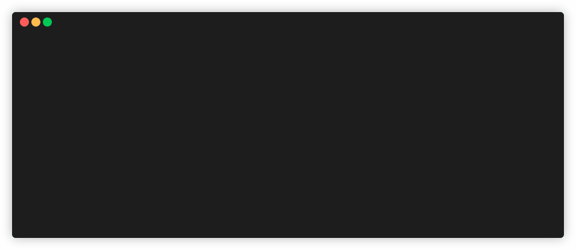

[donate-saweria::shield]: https://img.shields.io/badge/Saweria-azisalvriyanto-orange.svg
[donate-saweria::url]: https://saweria.co/azisalvriyanto
[donate-trakteer::shield]: https://custom-icon-badges.demolab.com/badge/Trakteer-azisalvriyanto-be1e2d.svg?logo=trakteer-red
[donate-trakteer::url]: https://trakteer.id/azisalvriyanto/tip
[donate-ko-fi::shield]: https://img.shields.io/badge/Ko--fi-azisalvriyanto-FF5E5B?logo=kofi
[donate-ko-fi::url]: https://ko-fi.com/azisalvriyanto
[donate-paypal::shield]: https://img.shields.io/badge/PayPal-membasuh-informational?logo=paypal
[donate-paypal::url]: https://paypal.me/membasuh

# laradock

> _To create a simple Laravel development environment using `Docker Compose`, which runs `PHP-FPM` and `Nginx`, and offers high flexibility for customization to suit your project's specific needs._

>

<div align="center">
    <picture>
        
    </picture>
</div>

>

`laradock` is a Docker Compose-based solution that allows you to run Laravel applications using `PHP-FPM` and `Nginx`. It is designed to be highly flexible, enabling you to customize the environment to meet the unique needs of your project. Whether you need to adjust ports, select specific PHP versions, or add additional tools and services, `laradock` makes it easy to create a development environment that works seamlessly for you.

**Key Features**

- Customizable Ports: You can configure any port for your application to fit your network setup, ensuring compatibility with your existing infrastructure.
- Flexible PHP Versions: Choose from a wide range of PHP versions available in the [official PHP image repository](https://hub.docker.com/_/php/tags?name=-fpm-alpine), allowing you to match the exact version required by your project.
- Extendable Environment: Easily add additional packages such as `bash`, `yarn`, or custom PHP extensions to tailor the environment to your needs.
- Nginx Customization: Modify Nginx configurations to suit your Laravel application, including SSL settings, rewrite rules, and other customizations.
- Customize Services: Add any additional services like `MySQL`, `Redis`, or any other dependencies your project may require.

For detailed instructions on how to customize your environment, refer to the following documentation:

- App Image: [`src/app/scripts/README.md`](./src/app/scripts/README.md)
- Web Image: [`src/web/scripts/README.md`](./src/web/scripts/README.md)
- Custom Services: [`src/custom/README.md`](./src/custom/README.md)

By following these resources, you can easily configure the development environment to match your precise needs, ensuring a streamlined and efficient Laravel development experience.

---

> [!IMPORTANT]
>
> New features will be added over time! Currently, it **ONLY** supports **Linux**, but I’d love to expand it to macOS too. If you’re interested in helping it grow, your support could even help me save up for a MacBook 💻 to make that happen — _but only if you’re definitely able to!_ 😊 🎉
>
> [![Saweria][donate-saweria::shield]][donate-saweria::url] &nbsp; [![Trakteer][donate-trakteer::shield]][donate-trakteer::url] &nbsp; [![Ko-fi][donate-ko-fi::shield]][donate-ko-fi::url] &nbsp; [![PayPal][donate-paypal::shield]][donate-paypal::url]

## 🛠️ Installation

1.  Clone the Repository:

    ```sh
    git clone git@github.com:fyvri/laradock.git
    ```

2.  Add `laradock` to Your `$PATH`:

    ```sh
    sudo ln -s $(pwd)/laradock/bin/laradock.sh /usr/local/bin/laradock
    ```

3.  Verify the Installation:

    ```sh
    which laradock
    ```

    _This should output the location where laradock is installed (e.g., /usr/local/bin/laradock)._

> [!NOTE]
> Ensure you have [`Docker`](https://docs.docker.com/engine/install/) installed and can run the `docker compose` command before proceeding.

## 🍻 Setup

- **App Image**

  The `app` image serves as the core environment for running your Laravel application and is built upon the `php:${version}-fpm-alpine` image. By default, the `app` image will install the following packages:

  - `composer`
  - `curl`
  - `freetype-dev`
  - `libjpeg-turbo-dev`
  - `libzip-dev`

  Additionally, the `app` image will install several PHP extensions by default, including:

  - `bcmath`
  - `gd`
  - `mbstring`
  - `opcache`
  - `pdo_mysql`
  - `zip`

  However, you have the flexibility to customize the image by adding any extra packages or dependencies that your app requires. You can do this by creating custom scripts in the `src/app/scripts/` directory. For detailed instructions on how to achieve this, please follow the steps outlined [here](./src/app/scripts/README.md).

- **Web Image**

  The `web` image is based on the `nginx:stable-alpine` image. It comes pre-configured to run `Nginx` and apply the necessary configurations for your app. However, if you need to add extra packages or replace the default Nginx configuration, you are free to modify it. To learn how to customize the `web` image, refer to the instructions provided [here](./src/web/scripts/README.md).

- **Custom Services**

  `laradock` allows you to design and customize your environment to include any services your project may require, such as `MySQL`, `Redis`, or any other dependencies. The system is pre-configured to automatically detect and process Docker Compose files that follow a specific naming convention, requiring these files to end with the `.docker-compose.yml` extension. For a step-by-step guide on how to customize your environment and configure these services, refer to the detailed documentation [here](./src/custom/README.md).

## 🚀 Usage

1.  Initialize:

    Navigate to your project directory and run the following command to initialize:

    ```sh
    laradock init
    ```

    _This command will prompt you for the project name, port, and PHP version. The Docker Compose settings will be saved in the `.laradock` directory._

2.  Build and Start Services:

    ```sh
    laradock compose
    ```

    _For more commands and options, run `laradock --help`._

## 🚩 Flags

This will display help for the tool. Here are all the full list of available commands and options it supports.

```console
$ laradock --help
______                 ____________       🐳 ______
___  /_____ _____________ ______  /_____________  /__
__  /_  __ '/_  ___/  __ '/  __  /  __ \  ___/_  //_/
_  / / /_/ /_  /   / /_/ // /_/ // /_/ / /__ _  ,<
/_/  \__^_/ /_/    \__^_/ \__,_/ \____/\___/ /_/|_|

Usage:  laradock [OPTIONS] COMMAND

Define and run multi-container applications with laradock

Options:
      --all-resources              Include all resources, even those not used by services
      --ansi string                Control when to print ANSI control characters ("never"|"always"|"auto") (default "auto")
      --compatibility              Run compose in backward compatibility mode
      --dry-run                    Execute command in dry run mode
      --env-file stringArray       Specify an alternate environment file
      --parallel int               Control max parallelism, -1 for unlimited (default -1)
      --profile stringArray        Specify a profile to enable
      --progress string            Set type of progress output (auto, tty, plain, json, quiet) (default "auto")
  -p, --project-name string        Project name

Commands:
  artisan     Execute artisan commands
  clean       Stop and remove all projects (images, containers, volumes and networks)
  composer    Execute composer commands
  compose     Build images and run containers in the background
  container   Manage containers
  image       Manage images
  init        Initialize laradock setup or reinitialize an existing one
  network     Manage networks
  reboot      Restart all services
  shutdown    Stop all services
  startup     Start all services
  volume      Manage volumes

Additional Commands:
  attach      Attach local standard input, output, and error streams to a service's running container
  build       Build or rebuild services
  commit      Create a new image from a service container's changes
  config      Parse, resolve and render compose file in canonical format
  cp          Copy files/folders between a service container and the local filesystem
  create      Creates containers for a service
  down        Stop and remove containers, networks
  events      Receive real time events from containers
  exec        Execute a command in a running container
  export      Export a service container's filesystem as a tar archive
  images      List images used by the created containers
  kill        Force stop service containers
  logs        View output from containers
  ls          List running compose projects
  pause       Pause services
  port        Print the public port for a port binding
  ps          List containers
  pull        Pull service images
  push        Push service images
  restart     Restart service containers
  rm          Removes stopped service containers
  run         Run a one-off command on a service
  scale       Scale services
  start       Start services
  stats       Display a live stream of container(s) resource usage statistics
  stop        Stop services
  top         Display the running processes
  unpause     Unpause services
  up          Create and start containers
  version     Show the Docker Compose version information
  wait        Block until containers of all (or specified) services stop.
  watch       Watch build context for service and rebuild/refresh containers when files are updated
```

## 👥 Contribution

If you have any ideas, [open an issue](https://github.com/fyvri/laradock/issues/new) and tell me what you think.

Contributions are what make the open-source community such an amazing place to learn, inspire, and create. Any contributions you make are **greatly appreciated**.

> [!WARNING]
> If you have a suggestion that would make this better, please fork the repo and create a pull request. Don't forget to give the project a star 🌟 I can't stop saying thank you!
>
> 1. Fork this project
> 2. Create your feature branch (`git checkout -b feature/awesome-feature`)
> 3. Commit your changes (`git commit -m "feat: add awesome feature"`)
> 4. Push to the branch (`git push origin feature/awesome-feature`)
> 5. Open a pull request

## 📜 License

This project is licensed under the [GNU GPLv3 License](./LICENSE). You are free to use, modify, and distribute it in accordance with the terms of this license.
